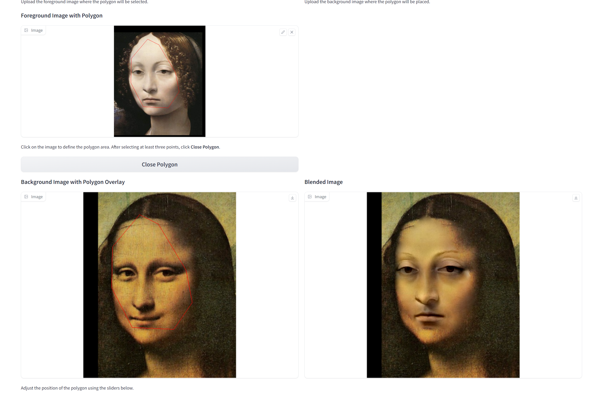

# Assignment 2 - DIP with PyTorch

### Resources:
- [Assignment Slides](https://rec.ustc.edu.cn/share/705bfa50-6e53-11ef-b955-bb76c0fede49)  
- [Paper: Poisson Image Editing](https://www.cs.jhu.edu/~misha/Fall07/Papers/Perez03.pdf)
- [Paper: Image-to-Image Translation with Conditional Adversarial Nets](https://phillipi.github.io/pix2pix/)
- [Paper: Fully Convolutional Networks for Semantic Segmentation](https://arxiv.org/abs/1411.4038)
- [PyTorch Installation & Docs](https://pytorch.org/)

---

### 1. Implement Poisson Image Editing with PyTorch.
Fill the [Polygon to Mask function](run_blending_gradio.py#L95) and the [Laplacian Distance Computation](run_blending_gradio.py#L115) of 'run_blending_gradio.py'.

### 2. Pix2Pix implementation.
See [Pix2Pix subfolder](Pix2Pix/).

---
